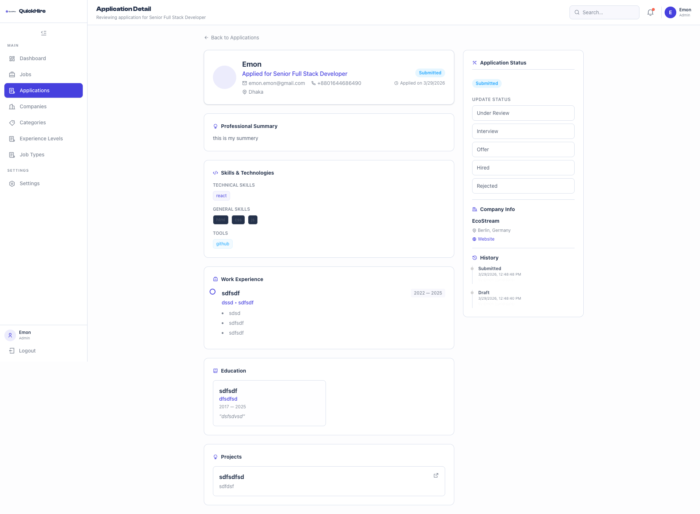
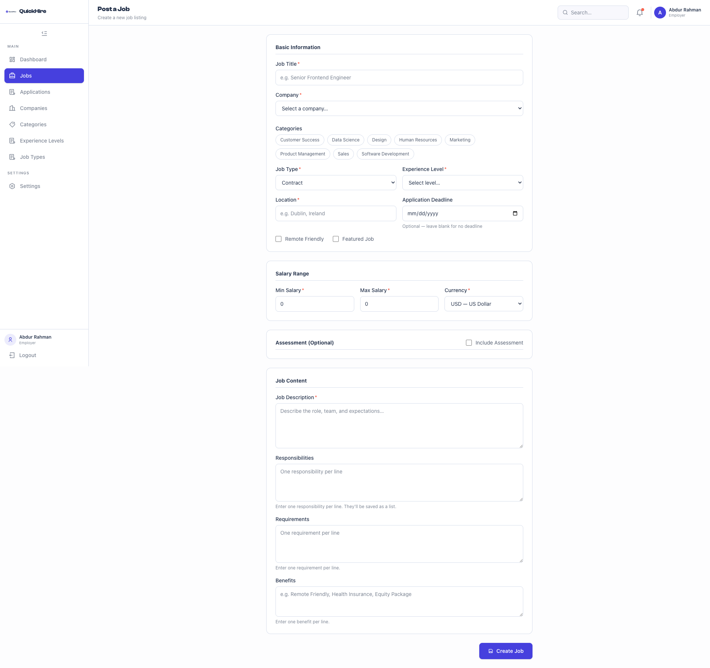

# QuickHire Frontend 🚀

Welcome to the **QuickHire Frontend**, a modern, high-performance job search and application platform. Built with **Next.js 15 (App Router)** and **React 19**, it provides a seamless and intuitive experience for candidates and employers.

---

## 📸 Screenshots & Key Features

### 📊 Admin Dashboard


_Real-time insights into job postings, applications, and performance metrics. Monitor active listings, drafts, and candidate engagement at a glance._

### 📝 Job Management


_A streamlined interface for employers to post and manage job listings. Includes detailed sections for job content, salary ranges, and optional assessments._

### 🔍 Application Tracking


_A comprehensive view of candidate applications. Review professional summaries, skills, work experience, and update application statuses with ease._

---

## 🌍 Live Application & Demo

- **Main Application:** `https://quick-hire-green.vercel.app`
- **Admin Dashboard:** `https://quickhire-dashboard.vercel.app/`

### 🔑 Demo Credentials

| Role      | Email                   | Password     |
| :-------- | :---------------------- | :----------- |
| **Admin** | `emon.admin@gmail.com`  | `password1!` |
| **Admin** | `emon.admin1@gmail.com` | `password1!` |
| **User**  | `emon.emon@gmail.com`   | `password1!` |

_You can also register and create a new user directly on the platform._

---

## 🛠 Technical Stack

### **Core Frameworks**

- **Framework:** Next.js 15 (App Router)
- **Library:** React 19
- **State Management:** TanStack Query v5 (React Query)
- **Authentication:** NextAuth.js
- **Styling:** Tailwind CSS 4 with Class Variance Authority (CVA)
- **API Client:** Axios with centralized interceptors

### **UI & Experience**

- **Icons:** React Icons & FontAwesome
- **Charts:** Recharts (for dashboard analytics)
- **Animations:** Framer Motion
- **Components:** Custom reusable UI components with focus on accessibility and responsiveness.

---

## 🚀 Performance & Architecture

QuickHire is engineered for speed and a smooth user experience. We've achieved high Lighthouse scores through several key strategies:

### **1. Server Components (RSC) Usage**

We heavily leverage **React Server Components** for critical parts of the application:

- **Why?** By fetching data on the server, we reduce the amount of JavaScript sent to the client, leading to faster initial page loads and improved SEO.
- **Where?** The Home page sections (Hero, Category, Featured Jobs, etc.) are rendered on the server, ensuring content is visible immediately.

### **2. Advanced Code Splitting & Lazy Loading**

- **`next/dynamic`:** Below-the-fold components like `Companies`, `FeaturedJobs`, and `LatestJobs` are loaded dynamically only when needed.
- **Suspense:** Wrapped dynamic components in `Suspense` with lightweight pulse fallbacks to maintain layout stability during loading.

### **3. LCP & Image Optimization**

- **`next/image`:** Used for automatic image optimization and lazy loading.
- **Priority Loading:** Above-the-fold images in the Hero section use the `priority` attribute to boost Largest Contentful Paint (LCP) performance.
- **SVG Optimization:** Large inline SVGs were extracted into separate components to keep the HTML payload small and maintainable.

### **4. TBT & Main-Thread Optimization**

- **Memoization:** Used `useMemo` and `useCallback` for complex UI logic (like the Job Search Bar) to prevent unnecessary re-renders and main-thread blocking.
- **Dynamic Hydration:** Non-critical UI elements like the profile dropdown and mobile menu are hydrated on demand.

---

## 🏁 Getting Started

### Prerequisites

- **Node.js** v20+
- **npm** or **yarn**

### 1. Installation

```bash
npm install
```

### 2. Environment Setup

Create a `.env.local` file:

```env
NEXT_PUBLIC_BACKEND_URL=https://job-backend-0q3q.onrender.com
NEXTAUTH_SECRET=your_secret
NEXTAUTH_URL=http://localhost:3000
```

### 3. Build & Run

```bash
# Development
npm run dev

# Production Build
npm run build

# Start Production
npm run start
```

---

## 📜 License

This project is licensed under the MIT License.

---

_Developed with ❤️ by the AREmon_
